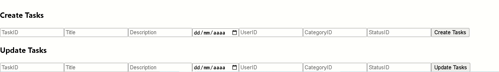
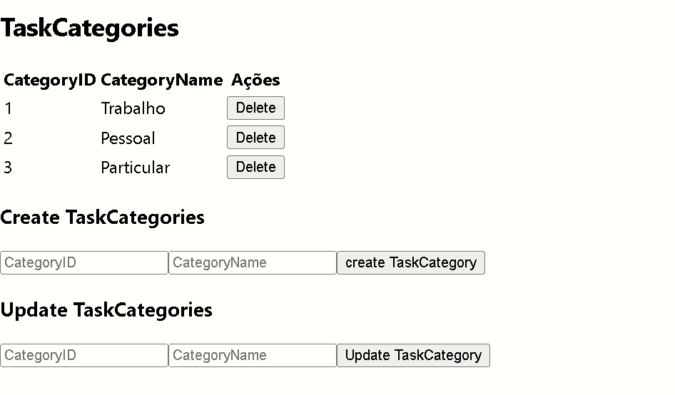
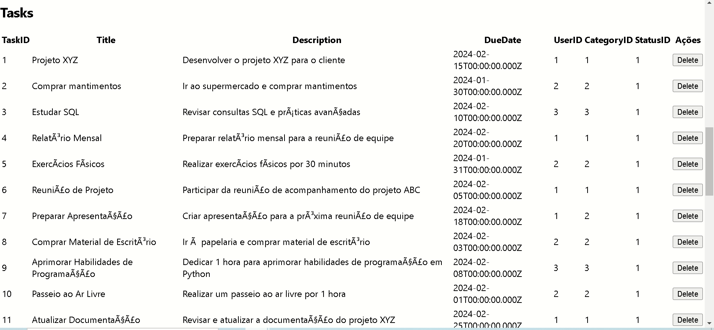
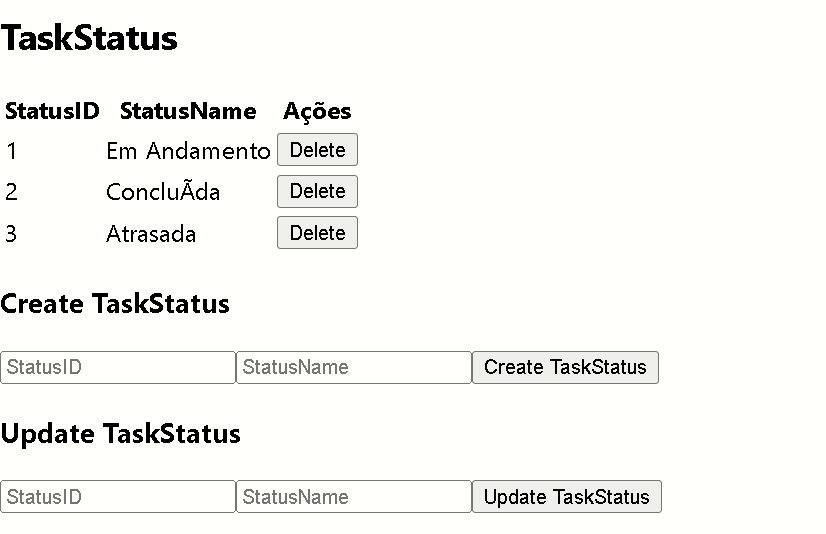
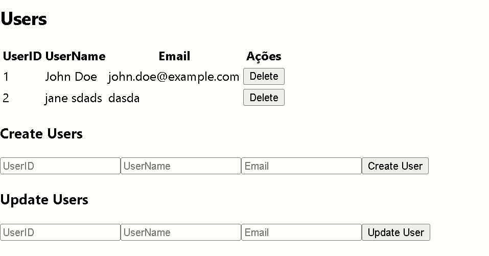

# TaskMaster

Repository to host the project developed for Desenvolvimento Web II, a 2024 subject at UMAIA. Developed by Group 4 : [@pedropires64](https://github.com/pedropires64), [@TiagoBaganha](https://github.com/TiagoBaganha) and [@Duarte35](https://github.com/Duarte35).

## Short theme description

The goal of this part of the roject is to develop a Web Client Application, in ReactJS, for access and querying resources made available by a Web REST API.
For this part, we used the API implemented in part 1 of this project and we implement a protection by an authentication and authorization layer.

## Repository organization

* Report chapters are in [doc folder](docsm2).
* Screenshots are in the [prints folder](prints).

## Gallery

| Page      | Image |
| ----------- | ----------- |
| Create Tasks      |        |
| Task Categories  |        |
| Tasks |        |
| Tasks Status      |        |
| Users   |        |

## Technologies

* [HTML5](https://html.spec.whatwg.org/multipage/) + [CSS3](https://www.w3.org/Style/CSS/)
* [Javascript](https://developer.mozilla.org/en-US/docs/Learn/JavaScript)
* [PHP](https://www.php.net/)
* [nodeJS](https://nodejs.org/en/)

### Frameworks and Libraries

* Docker: Used for containerizing the application and its dependencies.
* Express.js: Framework used for building the RESTful API.
* Passport.js: Middleware for authentication, specifically with GitHub OAuth 2.0 in this project.
* Swagger: For API documentation and testing.
* JQuery: For handling JavaScript operations on the frontend.
* Bootstrap: For styling and responsive design.
* ReactJS: For building the user interface.
* GitHub OAuth 2.0: For user authentication.

### Project presentation
* Chapter 1 :[Project presentation](docsm2/projectpresentation.md)
### Resources
* Chapter 2 :[Resources](docsm2/resources.md)
### Product
* Chapter 3 :[Product](docsm2/product.md)

## Grupo _04_
* Pedro Pires | a038057
* Tiago Baganha | a041423
* Vitor Duarte | a042396
